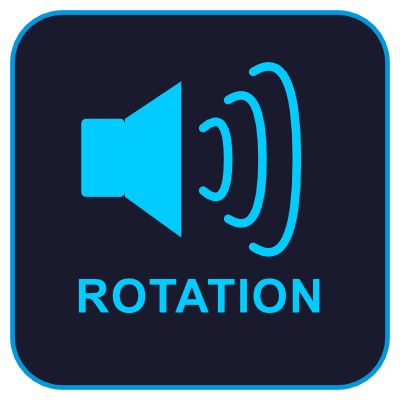

# AssistedCombatAudio



A World of Warcraft addon that provides **audio cues** for the Assisted Combat (rotation helper) system introduced in The War Within (12.0.1+). Instead of watching the glowing icon on your action bar, you **hear** which key to press next.

## About

This is a **side project** made for the World of Warcraft community. I do not make any money or gain any benefit from this addon — it is entirely free and built out of passion for the game and its players.

## Inspiration

This addon was inspired by [Simple Assisted Combat Icon](https://www.curseforge.com/wow/addons/simple-assisted-combat-icon).

## Features

- Announces the recommended spell keybind as an audio cue (e.g., "A", "3", "E")
- Supports **20 keys**: A, Z, E, R, T, Q, S, D, F, G, W, X, C, V, B, 1, 2, 3, 4, 5
- Compatible with **4 action bar addons**:
  - Default Blizzard UI
  - Bartender4
  - Dominos
  - ElvUI
- **Audio ducking**: temporarily reduces SFX, music, and ambience volume so the cue is clearly heard
- Configurable display modes: Always, In Combat only, Hostile Target only, or Combat OR Hostile Target
- Auto-mute options: on mount, in vehicle, or when assigned as healer
- Native WoW Settings panel integration (Escape > Options > AddOns)

## Installation

1. Download and extract the `AssistedCombatAudio` folder into your WoW addons directory:
   ```
   World of Warcraft/_retail_/Interface/AddOns/AssistedCombatAudio/
   ```
2. Make sure Assisted Combat is enabled in WoW (Game Menu > Options > Gameplay > Combat > Assisted Combat).
3. Reload your UI or restart the game.

## Slash Commands

| Command        | Description                 |
| -------------- | --------------------------- |
| `/aca`         | Open the settings panel     |
| `/aca on`      | Enable audio cues           |
| `/aca off`     | Disable audio cues          |
| `/aca test`    | Play all available sounds   |
| `/aca status`  | Show current configuration  |

## Settings

Access settings via `/aca` or Escape > Options > AddOns > Assisted Combat Audio.

- **Enable/Disable** - Toggle audio announcements
- **Sound Channel** - Master, SFX, or Dialog (Dialog recommended, as you can adjust its volume independently)
- **Audio Ducking** - Reduce other sound volumes (0-100%) when a cue plays
- **Display Mode** - When audio cues are active (always, combat, hostile target, or both)
- **Mute Conditions** - Mute on mount, in vehicle, or when playing as healer

## Audio Language

The current audio files are in **French**. If you would like audio cues in another language, feel free to open an issue or contact me — I'd be happy to add support for your language.

## File Structure

```
AssistedCombatAudio/
├── AssistedCombatAudio.lua    -- Main addon code
├── AssistedCombatAudio.toc    -- Addon metadata
├── sounds/                    -- Audio files (.ogg) for each key
│   ├── key_a.ogg
│   ├── key_1.ogg
│   └── ...
├── images/                    -- Project images
│   ├── icon.png
│   └── icon.svg
└── README.md
```

## License

This project is provided as-is for personal use. Feel free to fork and modify it.
